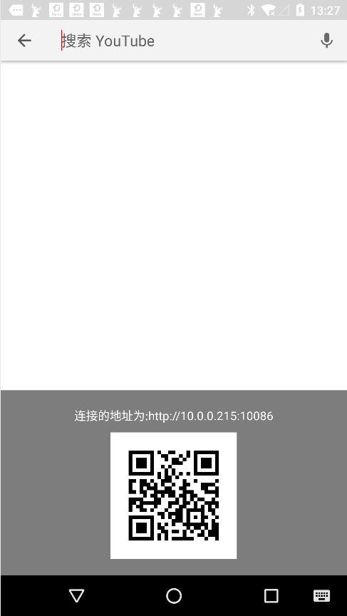
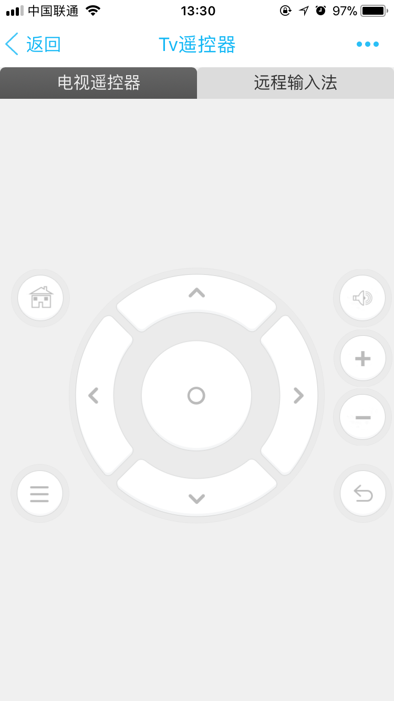
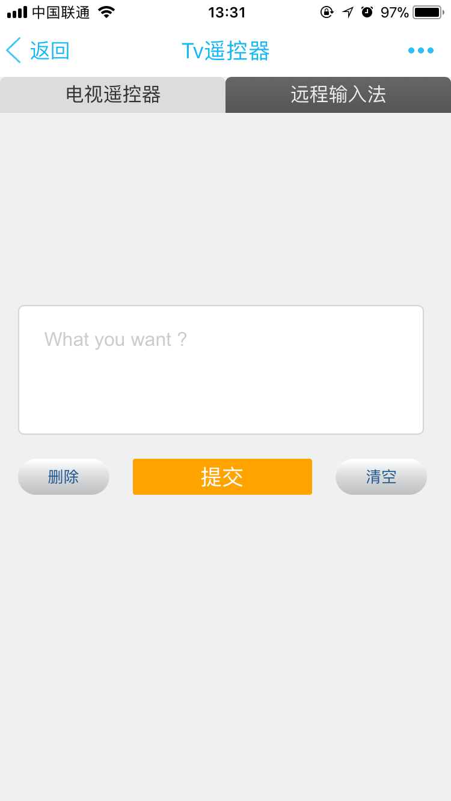

# Android Tv 远程遥控器 & 输入法
> 特别说明: 该项目的部分资源来自 [TVRemoteIME](https://github.com/kingthy/TVRemoteIME) , 另外本项目只在坚果P2上进行了简单的测试, 只作为娱乐,不进行维护.

## 设置电视盒子的默认输入法
 
在电视盒子上将默认输入法设置为 `Tv远程输入法` , 此时会弹出连接电视盒子输入法的二维码界面, 如图(截图是手机页面，没有从电视盒子上截图)所示: 
 
 
 
## 手机端(控制端)配置
 
 控制端通过QQ、微信等客户端扫描二维码或者手动输入连接地址打开控制页面，如下图所示: 
 
 
遥控器页面 | 输入法页面 |
 -----------|-----------|
 |  |

然后进行操作即可.

## 编程接口

* 遥控器按键接口
    * url?key=按键编码 , 其中具体的按键编码可以自己查询资料.
* 输入法接口
	* url?text=要输入的文本

核心类: RouterServer.java 、ServerInputMethodService.java .